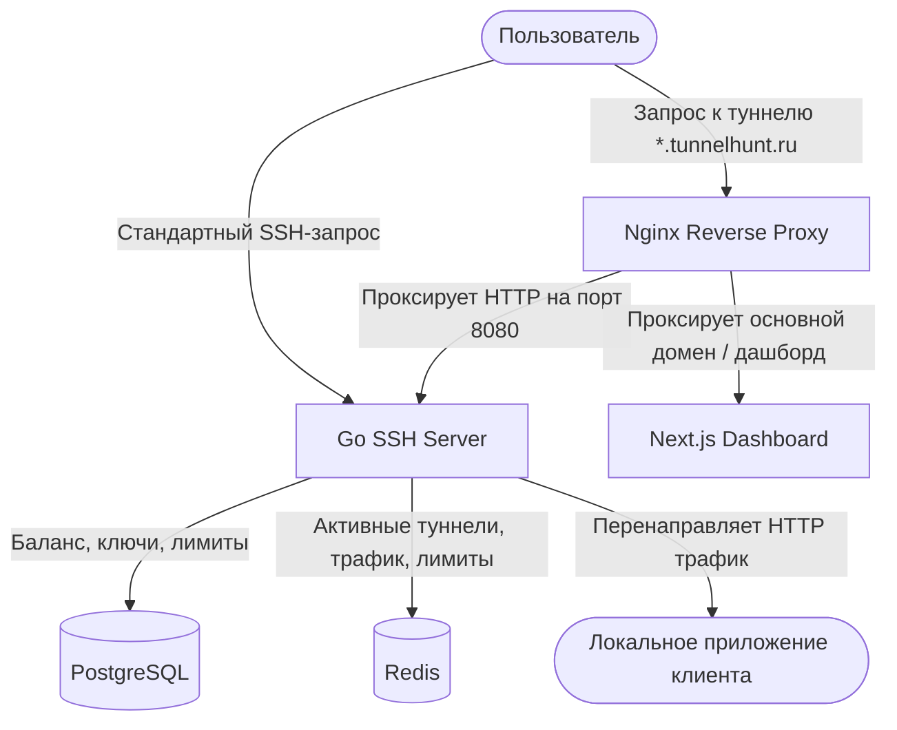

# <div align="center">🕵️‍♂️ Tunnelhunt</div>

<div align="center">
  <strong>Современная, быстрая и легкая альтернатива ngrok / localtunnel</strong>
  <br />
  Работает через стандартный SSH-клиент без установки какого-либо софта.
</div>

<br />

<div align="center">
  <a href="https://tunnelhunt.ru"><strong>Сайт проекта</strong></a>
  <span>•</span>
  <a href="https://tunnelhunt.ru/dashboard"><strong>Панель управления</strong></a>
</div>

<hr />

## 🚀 Быстрый старт

Вам не нужно регистрироваться или устанавливать сторонние утилиты. Просто запустите команду в терминале, указав ваш локальный порт (например, `8080`):

```bash
ssh -R 80:localhost:8080 tunnelhunt.ru
```

После выполнения команды в терминале появится ссылка вида `https://<subdomain>.tunnelhunt.ru`, по которой ваше локальное приложение будет доступно всему миру!

---

## 🛠 Публичные репозитории

Мы стремимся сделать интеграцию Tunnelhunt максимально удобной на всех платформах. Ниже представлены наши официальные опенсорс-проекты:

### 🤖 [mcp](https://github.com/tunnelhunt/mcp) — MCP Server для ИИ-разработки
Официальный сервер **Model Context Protocol (MCP)**, который обучает ИИ-агентов (Claude Desktop, Cursor, Cline) самостоятельно управлять туннелями.
* **Для чего:** Идеально подходит для **Vibe Coding**. Агент может сам открыть туннель для тестирования веб-интерфейса или приема вебхуков, проанализировать логи и закрыть его по окончании работы.
* **Быстрый запуск:** `npx -y @tunnelhunt/mcp`
* **Стек:** TypeScript, Node.js.

### 🍎 [macos](https://github.com/tunnelhunt/macos) — Нативный macOS-клиент
Легковесное native-приложение для macOS, которое располагается в панели меню (Menu Bar) и позволяет управлять вашими туннелями в один клик.
* **Возможности:** Управление пресетами, мгновенное копирование выданных URL, работа в фоне без захламления Dock-панели.
* **Стек:** Swift / Swift Package Manager.

### 💻 [desktop](https://github.com/tunnelhunt/desktop) — Кроссплатформенный клиент
Универсальное приложение для системного трея, поддерживающее **Windows, Linux и macOS**.
* **Возможности:** Полностью повторяет интерфейс нативного macOS-клиента, поддерживает сворачивание при потере фокуса, кастомные SSH-ключи, автоматическое переподключение и уведомления.
* **Стек:** Tauri v2, Rust, HTML/CSS/JS.

---

## 🏗 Как устроен Tunnelhunt под капотом?



1. **Nginx Edge Proxy** принимает входящие HTTP/HTTPS-запросы на порты `80`/`443` и проксирует их на Go SSH-сервер.
2. **Go SSH Server (Core)** авторизует SSH-сессии, выделяет субдомен и связывает входящие HTTP-запросы с соответствующими туннелями.
3. **SSH Tunnel** передает трафик от сервера на локальную машину пользователя и возвращает ответы обратно.

---

<div align="center">
  <sub>Создано с ❤️ командой Tunnelhunt. Вопросы или предложения? Пишите нам на <a href="mailto:support@tunnelhunt.ru">support@tunnelhunt.ru</a>.</sub>
</div>
